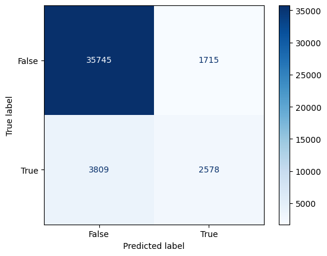
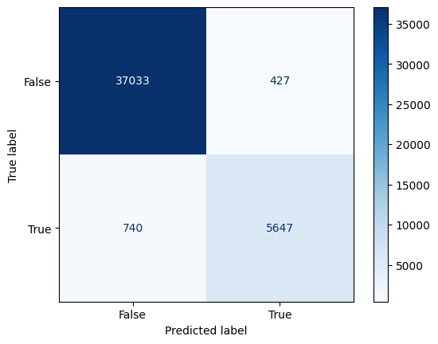

# Recipes Predictions

#### Refer to this [website](https://anmarkova2223.github.io/recipes-throughout-years/) for our EDA on this dataset

## Framing the Problem

In this model we are trying to classify our recipes into desserts and non-desserts using Binary classification. We decided to choose dessert or not as our response variable because it would be useful in classifying recipe types. Not every recipe has the appropriate tags, and classifying something as a dessert or not is one step towards figuring out what kind of recipe it is. We are using the information we have available about the recipes to predict whether it's a dessert or not, such as sugar, carbohydrates, total_fat, and minutes it takes to prepare.

We decided to use F1-score as our evaluation metric because we care about both precision and recall. We picked it over accuracy because we have a lot of recipes that are not desserts, so even if most desserts are classified incorrectly but non-dessert recipes are classified correctly, in other words if we have a lot of true negatives and false negatives, we would still have high accuracy. High number of non-dessert recipes skews accuracy, so we chose to go with F1- score as our statistic of choice. It  allows us to check for a high number of true negatives and a high number of true positives. 

## Baseline Model

After exploring KNeighborsClassifier and LogisticRegression, we used RandomForestClassifier as our baseline model. For our baseline model, we are trying to predict whether the recipe is a dessert or not using two quantitative features: `total_fat` and `sugar`. Since they are part of the nutritional value of the recipe they have similar values, so we decided not to transform the values using standardizers. We  also created a column `desserts` indicating whether  `desserts` is in the recipe's `tags`.

We first split our data set into a training and a test set with 80% in our training set and 20% in our test set. Since we are only using `total_fat` and `sugar` for our baseline models, we only select these two columns to be X and the `desserts` column as Y from our cleaned dataframe to fit the model using both of the quantitative features. 

We fit our training data to the RandomForestClassifer() with max_depth=8, n_estimators=7. When we tested on our test set, the model has F1-score of 0.4827. We were also curious about its accuracy and discovered that it's 0.9143. We thought thay it was odd, and decided to explore how good our baseline model acutally is by creating a confusion matrix.

As you can see this model has high accuracy because it classifies most of true negative correctly, however, it is not so great at classifying true positives. In fact it identifies about half of actually dessert recipes as not desserts. However, since most of the dataset is not recipes, and it identifies those correctly, the accuracy is high. F1-score of 0.4827 is actually more representative of how our model is doing, which is not so great. 

We believe that our current models achieve fair performance, since `sugar` is used to train our model. Most of the desserts would have much higher sugar content compared to other foods, so using this information would greatly improve our models’ performance. However, we would still like to see what are the other features that could help us better predict if the recipe given is a dessert or not. 

## Final Model

For our final model, we add three more features: ‘calories’, ‘minutes’ and ‘carbohydrates.’ When looking at recipes of desserts, we could expect that they would have higher calories compared to other foods since a lot more high-calorie ingredients such as sugar, butter, and cream are used to make desserts. We also believe that it takes more time to make desserts since we would usually expect a longer preparation and baking time for making desserts. Some desserts need to be put into the fridge for hours after it’s baked and before they are ready which would even make their ‘minutes’ to have larger values. Since we could observe some general patterns for desserts in these three features, we believe that including these features would improve our model’s f1-score in predicting whether the recipe is a dessert. Since sugar is one of the main types of carbohydrates and flour, which is high in carbs, is one of the most common ingredients used in desserts, we believe that we would see desserts tend to have higher total carbohydrates compared to other foods.

We decided to train our final model with RandomForestClassifer() and see if our model performance improved compared to the one fitted in our baseline models. For this model, we will be using our training set generated before fitting our baseline models and we will be using [`total_fat`, `sugar`, `calories`, `minutes`, `carbohydrates`, `desserts`]. Then we would like to know what is the best tree depth for our random forest model, so we are going to perform a 5-fold cross validation. In each fold, we are going to fit a random forest model from `max_depth = 2` to `max_depth = 30`, `min_samples_split': [2, 5, 10, 20]`, and `criterion: ['gini', 'entropy']` and see which parameters would have the highest average accuracy rate across 5 folds.

The best parameters ended up being: `'criterion': 'gini', 'max_depth': 28, 'min_samples_split': 2`

When we tested this model with our test set, the f1-score yielded is about 0.908. Compared to our baseline models which had f1-score around 0.4827, our model has a around 0.42 increase in its prediction f1-score.

We see this reflected in its confusion matrix as well.

 
## Fairness Analysis

We decided to choose the rating which the recipe got to check if our model classified higher rated recipes and lower rated recipes equally as well. Higher ratings were a part of group X while lower ratings were a part of group Y. Our hypothesis were the following:

**Null**: Our model is fair. Its true positive parity for higher and lower ratings is roughly the same and any differences are due to random chance alone.

**Alternative**:  Our model is not fair. Its true positive parity for higher and lower ratings are different.

We chose the absolute difference of means as our test statistics. We decided to choose 10% significance level since we are doing a one-tailed test in order to reject the null hypothesis at a high significance level. The p-value we found was 0.206, 0.206 is less extreme than 0.1, which is why we fail to reject the null, and conclude that our model is fair.

